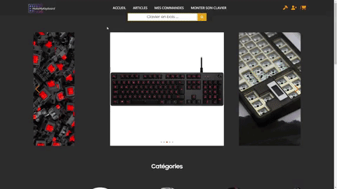

# 🛒Projet e-commerce | ReactJS Symfony💰
  
Projet e-commerce de fin de première année.  
Méthode agile.  
  
`Démarrer le projet :`  
```
Cloner le dépôt

dossier Front :
npm install
npm start

dossier Back :
composer install
symfony serve
```

